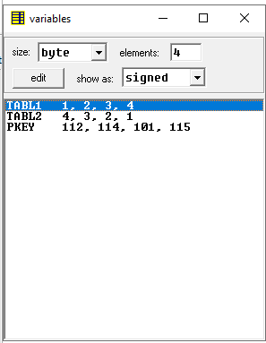
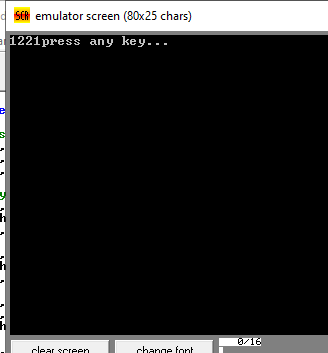

# x86-assembly-program
A basic x86 Assembly language project focusing on program structure, register manipulation, and step-by-step debugging in emu8086.
# Assembly Language Labs (emu8086)

Two simple low-level programs written in 8086 Assembly using the **emu8086** emulator.

---

## 📋 Lab 1: Array Reversing (`code.asm`)

This program copies elements from one array (`tabl1`) to another (`tabl2`) in reverse order. 

* **Source array:** `1, 2, 3, 4`
* **Result array:** `4, 3, 2, 1`

Below is the screenshot showing the values of the variables in memory after running the code:

  

---

## 📋 Lab 2: Character Swapping (`code2.asm`)

This program reads two characters typed by the user, swaps them, and then outputs them in reverse order.

* **Input:** User types two symbols (for example, `1` and `2`).
* **Output:** The program prints them back swapped (as `2` and `1`).

Below is the emulator console screenshot showing the input and output result:

  

---

## ⚙️ How to Run
1. Open either `code.asm` or `code2.asm` in the **emu8086** emulator.
2. Click **Emulate** and then **Run**.
